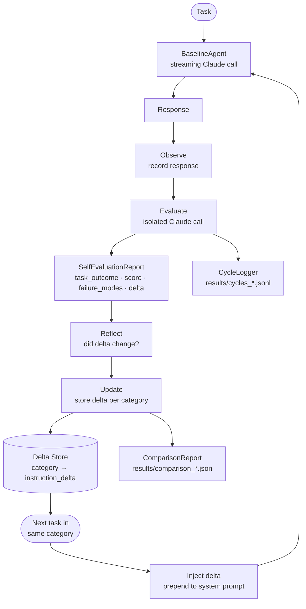
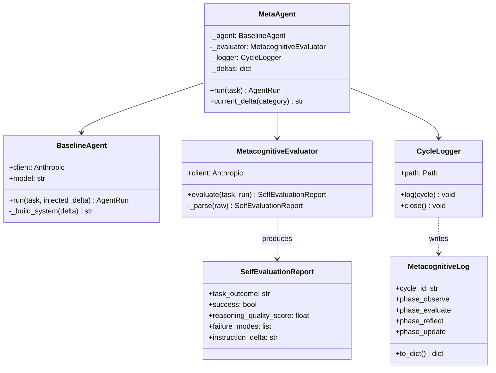
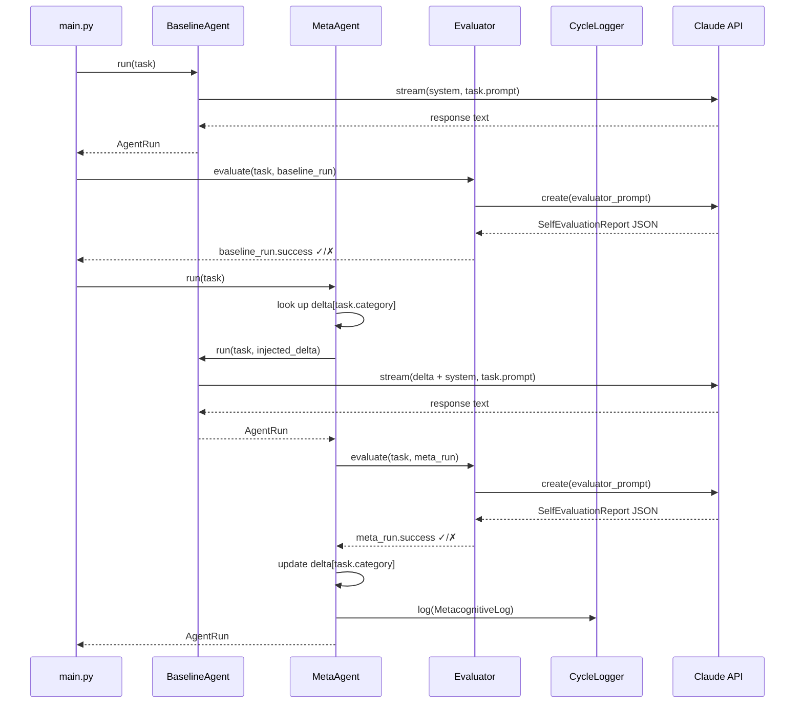

# Agent Meta Cognition — POC

> **Author:** Eduardo Arana  
> **Status:** Proof of Concept  
> **Model:** `claude-opus-4-6` (Anthropic SDK)  
> **Spec:** `.openspec/specs/agent-metacognition-poc.spec.yaml`

A proof-of-concept that applies the **Meta Cognition** paradigm to AI agents.
A metacognitive layer wraps a standard Claude agent, observes each task run,
evaluates performance, and generates updated instructions that are injected into
the agent's next invocation — enabling the agent to **self-evolve** without human
intervention.

---

## What is Meta Cognition?

Metacognition is _"thinking about thinking"_ — the capacity to monitor, evaluate,
and regulate one's own cognitive processes.  First formalised by developmental
psychologist John Flavell (1979), it is now a cornerstone of learning science.

> _"Metacognition refers to one's knowledge concerning one's own cognitive processes
> and products or anything related to them."_  
> — Flavell, J. H. (1979)

The concept maps onto an agent loop as four phases:

| Human metacognition | Agent phase | Implementation |
|---|---|---|
| Observe thought process | **Observe** | Record full agent response |
| Evaluate reasoning quality | **Evaluate** | Isolated evaluator Claude call |
| Identify failure modes | **Reflect** | `failure_modes[]` + `reasoning_quality_score` |
| Adjust strategy for next attempt | **Update** | `instruction_delta` → system prompt |

---

## System Architecture

### High-level flow



### Component diagram



### Sequence — one task run



---

## Project Structure

```
agent-metacognition/
├── main.py                  # CLI — --mode compare --tasks <file>
├── requirements.txt
├── src/
│   ├── models.py            # Task, AgentRun, SelfEvaluationReport,
│   │                        #   MetacognitiveLog, ComparisonReport
│   ├── agent.py             # BaselineAgent  (streaming + prompt caching)
│   ├── evaluator.py         # MetacognitiveEvaluator (isolated judge)
│   ├── meta_agent.py        # MetaAgent  (observe → evaluate → reflect → update)
│   └── logger.py            # CycleLogger  (JSON Lines)
├── tasks/
│   └── general.yaml         # 9 benchmark tasks (3 categories × 3 tasks)
├── results/                 # Runtime output — JSON reports + cycle logs
└── .openspec/
    └── specs/agent-metacognition-poc.spec.yaml
```

---

## Getting Started

### Prerequisites

- Python 3.11+
- An [Anthropic API key](https://console.anthropic.com/)

### Install

```bash
pip install -r requirements.txt
```

### Run

```bash
export ANTHROPIC_API_KEY=sk-ant-...

python main.py --mode compare --tasks tasks/general.yaml
```

The CLI will:

1. Run a **BaselineAgent** (no self-reflection) on every task.
2. Run a **MetaAgent** (metacognitive loop) on the same tasks in the same order.
3. Print a side-by-side comparison table in the terminal.
4. Write two files to `results/`:
   - `comparison_<timestamp>.json` — full report with per-task outcomes and all cycle logs.
   - `cycles_<timestamp>.jsonl` — one JSON Line per metacognitive cycle for offline analysis.

### CLI flags

| Flag | Default | Description |
|---|---|---|
| `--mode compare` | — | Required. Executes both agents on the task set. |
| `--tasks FILE` | — | Required. Path to a YAML benchmark task file. |
| `--output DIR` | `results/` | Directory for JSON output. |

---

## Benchmark Tasks

`tasks/general.yaml` — 9 tasks across three categories:

| Category | Tasks | Reasoning pattern the meta agent learns |
|---|---|---|
| `logical_reasoning` | Seating constraints · Truth-teller puzzle · Compound inference | Enumerate possibilities before eliminating |
| `mathematical` | Mixture · Rate-work · Quadratic word problem | Define variables first; set up equations before computing |
| `code_analysis` | Off-by-one bug · List mutation bug · Complexity analysis | Trace execution line-by-line; state error type and location |

Tasks within a category share a reasoning pattern so a failure on task _N_
generates a useful `instruction_delta` that improves tasks _N+1_ and _N+2_,
demonstrating within-category self-evolution.

---

## Output Schema

### `SelfEvaluationReport`

```jsonc
{
  "task_outcome": "The agent correctly identified the seating arrangement.",
  "success": true,
  "reasoning_quality_score": 7.5,       // 0–10
  "failure_modes": [],
  "instruction_delta": "When solving constraint-satisfaction problems, enumerate all candidate positions for the fixed variable first, then apply remaining constraints in order of most restrictive."
}
```

### `MetacognitiveLog` (one JSON Line per cycle)

```jsonc
{
  "cycle_id": "e3f7a1b2-…",
  "task_id": "lr-002",
  "task_category": "logical_reasoning",
  "timestamp": "2026-04-15T14:23:01.123456",
  "phase_observe":  { "agent_success": false, "injected_delta": null },
  "phase_evaluate": { "success": false, "reasoning_quality_score": 4.0,
                      "failure_modes": ["jumped to conclusion without enumeration"],
                      "instruction_delta": "When answering logic puzzles…" },
  "phase_reflect":  { "previous_delta": null, "delta_changed": true },
  "phase_update":   { "new_delta": "When answering logic puzzles…" }
}
```

---

## References

### Metacognition — foundational theory

- **Flavell, J. H. (1979).** "Metacognition and cognitive monitoring: A new area of cognitive–developmental inquiry."  
  *American Psychologist, 34*(10), 906–911.  
  <https://doi.org/10.1037/0003-066X.34.10.906>

- **MIT Teaching + Learning Lab — Metacognition.**  
  Practical overview of metacognitive strategies and their role in deep learning.  
  <https://tll.mit.edu/teaching-resources/how-people-learn/metacognition/>

- **Schraw, G., & Dennison, R. S. (1994).** "Assessing Metacognitive Awareness."  
  *Contemporary Educational Psychology, 19*(4), 460–475.  
  Introduces the two-factor model (knowledge of cognition + regulation of cognition)
  that maps onto the evaluate and update phases in this POC.

### Self-reflection and self-improvement in LLMs

- **Shinn, N., Cassano, F., Labash, A., Gopinath, A., Narasimhan, K., & Yao, S. (2023).**  
  "Reflexion: Language Agents with Verbal Reinforcement Learning." *NeurIPS 2023.*  
  <https://arxiv.org/abs/2303.11366>  
  Closest prior work: agents reflect on failed trajectories and store verbal
  reinforcement signals — directly inspired the `instruction_delta` design.

- **Madaan, A., Tandon, N., Gupta, P., et al. (2023).**  
  "Self-Refine: Iterative Refinement with Self-Feedback." *NeurIPS 2023.*  
  <https://arxiv.org/abs/2303.17651>  
  LLMs iteratively improve their own outputs via self-generated feedback,
  without additional training.

- **Yao, S., Zhao, J., Yu, D., et al. (2023).**  
  "ReAct: Synergizing Reasoning and Acting in Language Models." *ICLR 2023.*  
  <https://arxiv.org/abs/2210.03629>  
  Foundational agent paper combining chain-of-thought reasoning with tool use.

### Anthropic SDK & features used

- **Anthropic — Prompt Caching.**  
  `cache_control` API used to cache stable system prompts across tasks.  
  <https://platform.claude.com/docs/en/build-with-claude/prompt-caching>

- **Anthropic — Claude Python SDK.**  
  <https://github.com/anthropics/anthropic-sdk-python>
